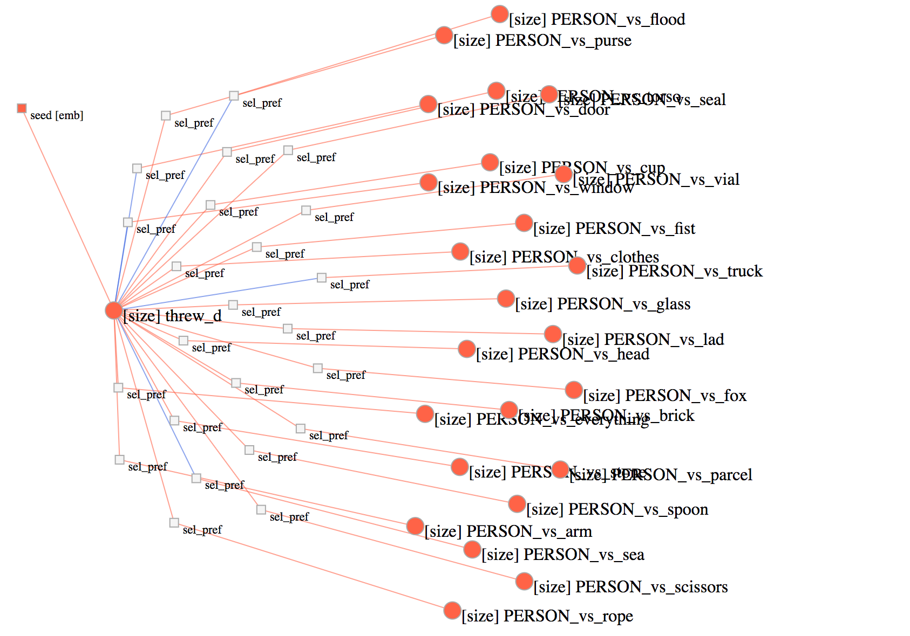

# verbphysics

[](https://travis-ci.org/uwnlp/verbphysics)
[](https://github.com/uwnlp/verbphysics/blob/master/LICENSE.txt)

## About

This repository contains the data and reference implementation for the paper

**Verb Physics: Relative Physical Knowledge of Actions and Objects**  
Maxwell Forbes and Yejin Choi  
_ACL 2017_

See the [Verb Physics project page](https://uwnlp.github.io/verbphysics/) for
more details (model visualiation, paper link, bibtex citation).

## Installation

The code is written in Python 2.7. We recommend a fresh virtualenv.

```sh
# Install the required python libraries
pip install -r requirements.txt

# Install the locally-packaged `ngramdb` library (written by Li Zilles).
pip install lib/ngramdb/

# Download the data (cached ngramdb data; GloVe embeddings; trained factor
# weights; NLTK data).
./scripts/data.sh
```

Our [Travis-CI
script](https://github.com/uwnlp/verbphysics/blob/master/.travis.yml) validates
the above installation instructions by running them on a fresh machine after
every code modification.

## Running

By default, the code is setup to run a particular model from the paper (**our
model (A)**)

```sh
python -m src.main
```

You can view all of the default configurations by running with `--help`

```
python -m src.main --help
usage: main.py [-h] [--config CONFIG] [--poly POLY] [--viz]

verbphysics reference implementation

optional arguments:
  -h, --help       show this help message and exit
  --config CONFIG  hyperparameter configuration to use; options: model_a |
                   playing | model_b_objpairs | model_b_frames (default:
                   model_a
  --poly POLY      Whether to try polynomially-many hyperparameter config
                   combinations (True, default) or vary config dimension
                   sequentially (False).
  --viz            Whether to dump model / data to JSON for visualization
                   (default False).
```

Settings (hyperparameter) configurations are found in `src/settings.py`. You
can modify the `playing` dictionary found in `src/main.py` with your own
configuration and run the custom model using `--config=playing`.

## Data

The `verbphysics` data is found under `data/verbphysics/`.

**Task setup as in the ACL 2017 paper**

When predicting action frames, only 5% action frame data should be used. Either
5% (our model A) or 20% object pair data (our model B) may be used to assist in
action frame prediction.

When predicting object pairs, only 5% object pair data should be used. Either 5%
(our model A) or 20% action frame data (our model B) may be used to assist in
object pair prediction.

## Visualization

You can use [`factorgraph-viz`](https://github.com/mbforbes/factorgraph-viz) to
visualize `verbphysics` factor graph models interactively in your web browser.
To produce visualization data, add the command line argument `--viz`.

The [Verb Physics project page](https://uwnlp.github.io/verbphysics/) has a
live demo of this running.



## See also

The [`py-factorgraph`](https://github.com/mbforbes/py-factorgraph) library
provides the underlying factor graph implementation.
